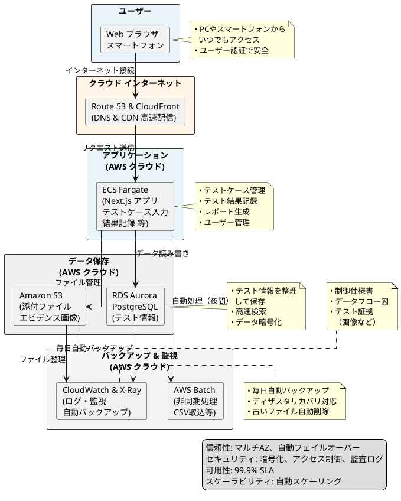
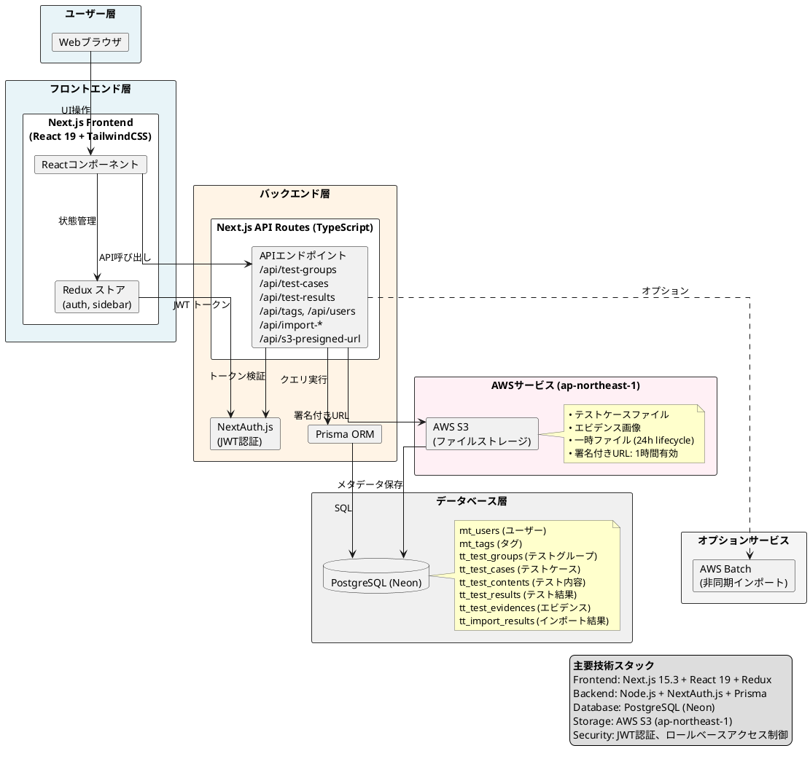
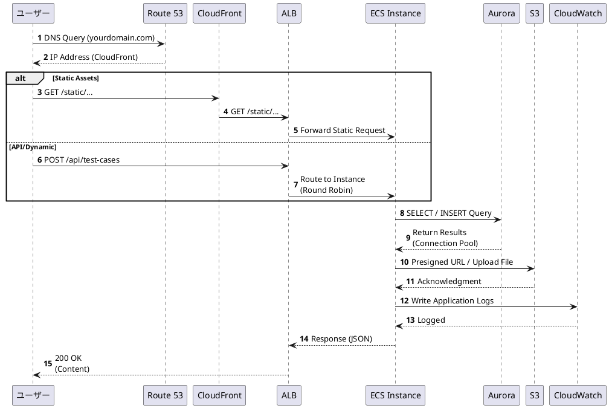
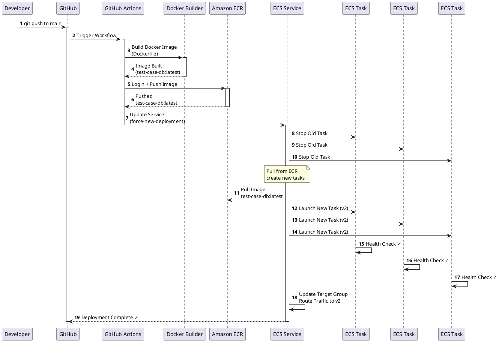
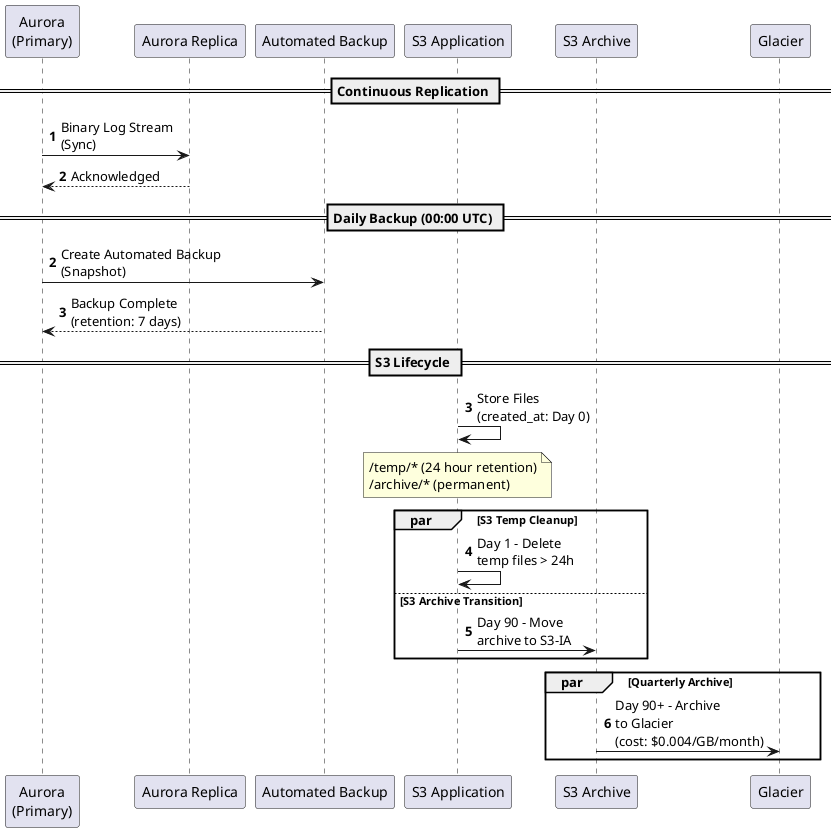
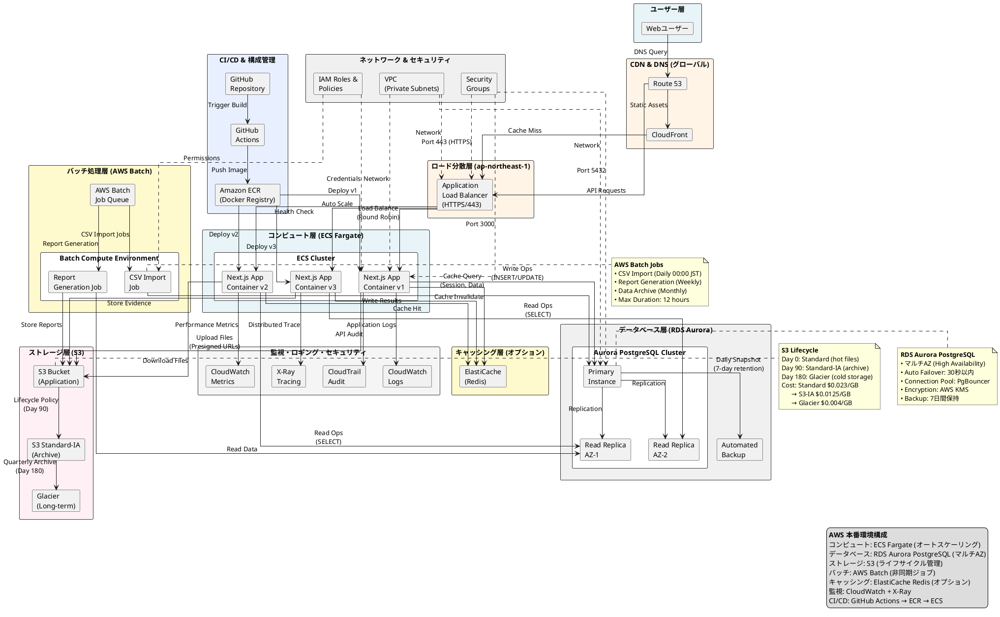
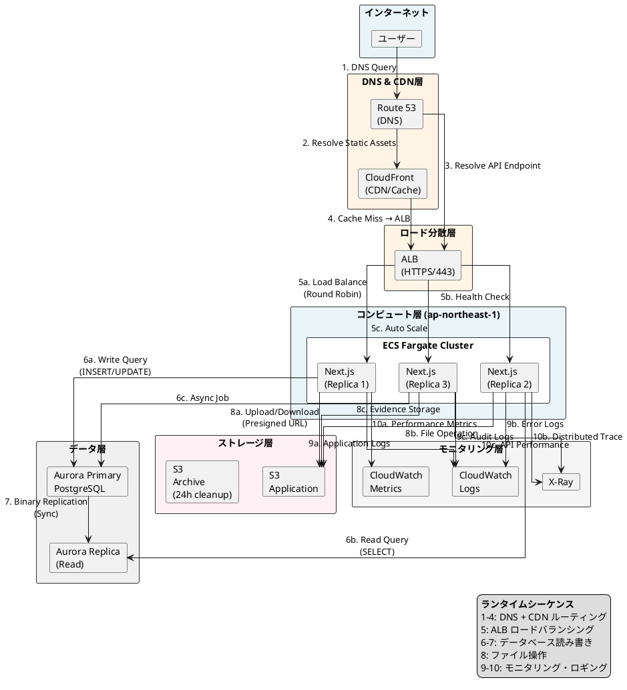

# テストケースDB システムアーキテクチャ

## 簡潔版アーキテクチャ（お客様向け）

### システム概要

このテストケースDB システムは、以下のようなシンプルな構成で実現されています：

1. **あなたのデバイス** (PC/スマートフォン)
   - Webブラウザでアクセス
   - ユーザー認証で安全にログイン

2. **インターネット接続層** (Amazon AWS)
   - **Route 53**: ドメイン名解決（DNS）
   - **CloudFront**: グローバルコンテンツ配信ネットワーク（CDN）

3. **クラウド上のアプリケーション** (Amazon AWS - ECS Fargate)
   - **ECS Fargate** 上で実行される Next.js アプリケーション
   - テストケース管理
   - テスト結果記録
   - ユーザー管理
   - レポート生成

4. **クラウド上のデータ保存** (Amazon AWS)
   - **RDS Aurora PostgreSQL**: テスト情報、ユーザー情報などを安全に保存
   - **Amazon S3**: 制御仕様書、テスト証拠などの添付ファイルを保存

5. **バックアップ & 監視** (Amazon AWS)
   - **CloudWatch**: ログ記録とシステム監視 (24時間監視)
   - **X-Ray**: リクエストトレーシングと性能分析
   - **RDS 自動バックアップ**: 毎日自動的にデータをバックアップ
   - **AWS Batch**: 非同期処理（CSV取込など）を夜間に実行

### 主要な特徴

| 特徴 | 説明 |
|-----|------|
| **信頼性** | 複数のデータセンター (マルチAZ) で運用、自動フェイルオーバー対応 |
| **セキュリティ** | 全データ暗号化、アクセス制御、監査ログ記録 |
| **可用性** | 99.9% の稼働保証 (年間99時間以内のダウンタイム) |
| **スケーラビリティ** | ユーザー数やデータ量に応じて自動的に拡張 |
| **バックアップ** | 毎日自動バックアップ、7日間保持 |

---

### ビジュアルアーキテクチャ図



---

## 詳細版アーキテクチャ（技術者向け）

### PlantUML アーキテクチャ図



## 主要コンポーネント

### フロントエンド
- **技術**: Next.js 15.3.3 + React 19
- **状態管理**: Redux Toolkit
- **スタイリング**: TailwindCSS 4.1.10
- **UIコンポーネント**: Radix UI
- **認証**: NextAuth.js セッションプロバイダー

### バックエンド
- **実行環境**: Node.js (Next.js API ルート)
- **認証**: NextAuth.js Credentials プロバイダー
- **ORM**: Prisma 6.19.0
- **データベースクエリ**: Prisma + Raw PostgreSQL (pg クライアント)
- **ファイル処理**: AWS SDK for S3

### データベース
- **種類**: PostgreSQL (Neon サーバーレス)
- **スキーマ**: 8つのメインモデル (ソフトデリート対応)
- **機能**: トランザクション、複合キー、監査フィールド (created_at, updated_at, created_by, updated_by)

### AWSサービス
- **S3**: テストケースファイル、エビデンス、一時アップロードのストレージ
- **Batch** (オプション): 非同期インポート処理用
- **リージョン**: ap-northeast-1 (東京)

## データフロー

### 1. テストケース新規登録
```
ユーザー → ブラウザ → Reactフォーム
  ↓
NextAuth検証
  ↓
Next.js API (/api/test-cases/regist)
  ↓
ファイルアップロード → AWS S3 (署名付きURL)
  ↓
メタデータ保存 → PostgreSQL (Prisma経由)
  ↓
確認 → ブラウザ
```

### 2. テスト結果記録
```
ユーザー → テスト結果フォーム
  ↓
エビデンスアップロード → AWS S3
  ↓
API /api/test-groups/[groupId]/cases/[tid]/results
  ↓
レコード作成 in tt_test_results
  ↓
前回結果をアーカイブ → tt_test_results_history
  ↓
Redux ストア更新
```

### 3. インポート処理
```
CSVファイルアップロード
  ↓
/api/import-cases または /api/import-users
  ↓
パース & バリデーション (CSV パーサー)
  ↓
データベーストランザクション
  ├→ レコード作成
  ├→ エラーログ
  └→ ステータス更新
  ↓
結果をブラウザに返す
```

## 環境変数設定
```bash
# データベース
DATABASE_URL=postgresql://user@localhost:5432/testcase_db

# NextAuth
NEXTAUTH_URL=http://localhost:3000
NEXTAUTH_SECRET=<base64エンコード済みシークレット>

# AWS
AWS_REGION=ap-northeast-1
AWS_ACCESS_KEY_ID=<キー>
AWS_SECRET_ACCESS_KEY=<シークレット>
AWS_S3_BUCKET_NAME=test-case-db-files

# ログ
NEXT_PUBLIC_ENABLE_CLIENT_LOGGING=true
```

## AWS デプロイメントアーキテクチャ

### ランタイムシーケンス（ユーザーリクエスト）



### デプロイメントシーケンス（CI/CD）



### データベースバックアップ & ストレージシーケンス



## AWS 本番環境詳細アーキテクチャ図



## ランタイムアーキテクチャ図



### AWS デプロイメント実装詳細

#### 1. **コンピュート層** - 2つの選択肢

**オプションA: ECS on Fargate (推奨 - 本番環境)**
```bash
# ECS Task Definition (Fargate)
- CPU: 1024 (1 vCPU) / 2048 (2 vCPU)
- メモリ: 2GB / 4GB
- ネットワークモード: awsvpc
- ログドライバー: awslogs (CloudWatch Logs)
- Auto Scaling: Target Tracking (CPU 70%, Memory 80%)
- リージョン: ap-northeast-1
```

**オプションB: App Runner (開発・小規模)**
```bash
# App Runner Service
- ソース: GitHub リポジトリ
- 自動デプロイ: 有効
- CPU: 0.25 vCPU / 1 vCPU
- メモリ: 512 MB / 2 GB
- スケーリング: 1～10 インスタンス
- コールドスタート時間: 1～2分
```

#### 2. **データベース層**

```bash
# Amazon Aurora PostgreSQL
- マルチAZ配置 (高可用性)
- 読み取りレプリカ: 1～15個 (読み込み負荷分散)
- バックアップ保持期間: 7日 (自動日次バックアップ)
- 自動フェイルオーバー: 有効 (30秒以内)
- パラメータグループ: カスタム最適化
- 暗号化: 保存時 (AWS KMS)、転送中 (SSL/TLS)
- ビジネスアワー外: 予約済みインスタンス
```

#### 3. **ストレージ層**

```bash
# Amazon S3
- バケット: test-case-db-files (us-east-1 リージョン)
- アクセス: VPC Endpoint (NAT料金削減)
- ライフサイクルポリシー:
  - /temp/* → 24時間後削除
  - /archive/* → 90日後 Glacier へ移動
- バージョニング: 有効 (データ保護)
- サーバー側暗号化: AES-256
- CloudFront オリジン: ダウンロード高速化
```

#### 4. **セキュリティ設定**

```bash
# VPC & ネットワークセキュリティ
- VPC: プライベートサブネット (各AZ)
- セキュリティグループ:
  * ALB: 443 (HTTPS) からのトラフィック許可
  * ECS: ALB からのみ 3000ポート許可
  * Aurora: ECS からのみ 5432ポート許可
- NAT ゲートウェイ: 送信トラフィック用

# IAM ロール & ポリシー
- ecsTaskExecutionRole: CloudWatch Logs, ECR 読み取り
- ecsTaskRole: S3, RDS (IAM認証)
- GitHub Actions: OIDC フェデレーション (キー不要)

# SSL/TLS
- ACM 証明書: 無料自動更新
- 最小TLSバージョン: 1.2
```

#### 5. **CI/CD パイプライン (GitHub Actions)**

```yaml
# .github/workflows/deploy.yml
name: Deploy to AWS

on:
  push:
    branches: [main]

jobs:
  build-and-deploy:
    runs-on: ubuntu-latest
    permissions:
      id-token: write
    steps:
      # 1. AWS認証 (OIDC)
      - name: Configure AWS credentials
        uses: aws-actions/configure-aws-credentials@v2
        with:
          role-to-assume: arn:aws:iam::ACCOUNT_ID:role/GitHubActionsRole
          aws-region: ap-northeast-1

      # 2. コンテナビルド
      - name: Build Docker image
        run: |
          aws ecr get-login-password --region ap-northeast-1 | \
            docker login --username AWS --password-stdin ACCOUNT_ID.dkr.ecr.ap-northeast-1.amazonaws.com
          docker build -t test-case-db:${{ github.sha }} .
          docker tag test-case-db:${{ github.sha }} \
            ACCOUNT_ID.dkr.ecr.ap-northeast-1.amazonaws.com/test-case-db:latest

      # 3. ECR へプッシュ
      - name: Push to Amazon ECR
        run: |
          docker push ACCOUNT_ID.dkr.ecr.ap-northeast-1.amazonaws.com/test-case-db:latest

      # 4. ECS デプロイ
      - name: Deploy to ECS
        run: |
          aws ecs update-service \
            --cluster test-case-db-cluster \
            --service test-case-db-service \
            --force-new-deployment \
            --region ap-northeast-1
```

#### 6. **環境変数・シークレット管理**

```bash
# AWS Secrets Manager
- NEXTAUTH_SECRET: 暗号化保存
- DATABASE_URL: Aurora エンドポイント
- AWS_ACCESS_KEY_ID: IAM ロール使用（不要）
- AWS_SECRET_ACCESS_KEY: IAM ロール使用（不要）

# Parameter Store (非機密設定)
- NEXTAUTH_URL: https://yourdomain.com
- AWS_REGION: ap-northeast-1
- AWS_S3_BUCKET_NAME: test-case-db-files
```

#### 7. **コスト最適化**

| リソース | 推定月額費用 | 最適化 |
|---------|----------|------|
| **ECS Fargate** | $50～100 | 自動スケーリング、オンデマンド |
| **Aurora PostgreSQL** | $100～200 | 予約済みインスタンス、オートスケーリング |
| **S3** | $10～50 | ライフサイクルポリシー、アクセスレベル |
| **CloudFront** | $20～50 | キャッシュ設定、リージョン最適化 |
| **CloudWatch** | $10～20 | ログ保持期間: 7日、メトリクスフィルター |
| **NAT Gateway** | $30 | VPC エンドポイント使用 |
| **合計** | **$220～450** | 予約済みインスタンス活用で -30% |

#### 8. **スケーリング戦略**

```bash
# ECS Auto Scaling
- ターゲットトラッキング: CPU 70%, Memory 80%
- 段階スケーリング: スケールアップ +2インスタンス, スケールダウン -1インスタンス
- クールダウン時間: 5分

# Aurora Auto Scaling
- 読み取りレプリカ: 自動追加（コンピュートスケーリング）
- ストレージ: 自動拡張 (初期 100GB → 最大 128TB)
```

#### 9. **ディザスタリカバリ**

```bash
# バックアップ戦略
- Aurora: 自動日次バックアップ + ポイントイン タイムリカバリ (7日)
- S3: バージョニング有効 + CloudTrail監査
- RTO (目標復旧時間): 30分
- RPO (目標復旧時点): 5分

# マルチリージョン (オプション)
- プライマリ: ap-northeast-1 (東京)
- セカンダリ: ap-southeast-1 (シンガポール)
- DMS (Database Migration Service) でレプリケーション
```

## セキュリティ機能

1. **認証**: NextAuth.js メール/パスワード + JWT
2. **認可**: ロールベースアクセス制御 (ADMIN, TEST_MANAGER, GENERAL)
3. **パスワード**: bcryptjsでハッシュ化 (ソルト付き)
4. **API保護**: ミドルウェアで JWT トークン検証
5. **S3アクセス**: 署名付きURL (1時間有効期限)
6. **監査ログ**: created_by, updated_by, created_at, updated_at フィールド
7. **ソフトデリート**: is_deleted フラグでデータ保持

## パフォーマンス考慮事項

1. **データベース**: コネクションプーリング (Neon経由)
2. **S3**: 署名付きURLで直接アップロード (サーバー経由不要)
3. **キャッシング**: Redux ストアでクライアント状態管理
4. **ページネーション**: APIエンドポイントで limit/offset サポート
5. **クエリ最適化**: PostgreSQL インデックス
6. **ログ**: クライアント/サーバー側ログでモニタリング

